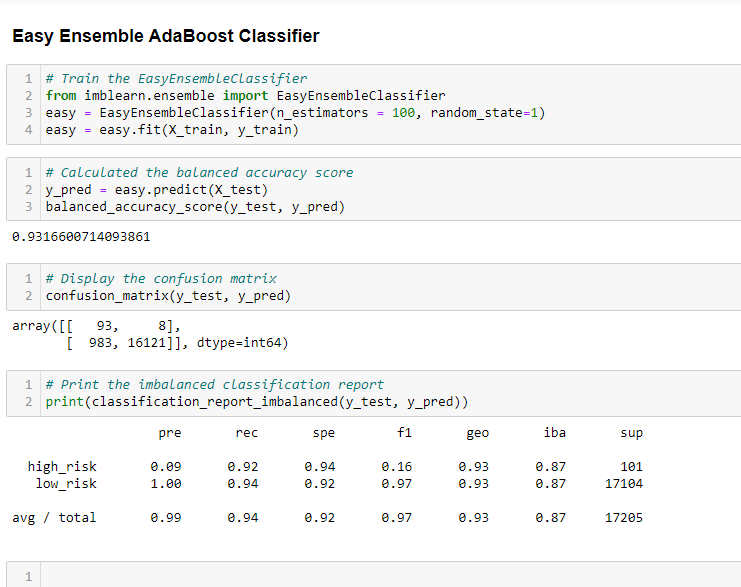
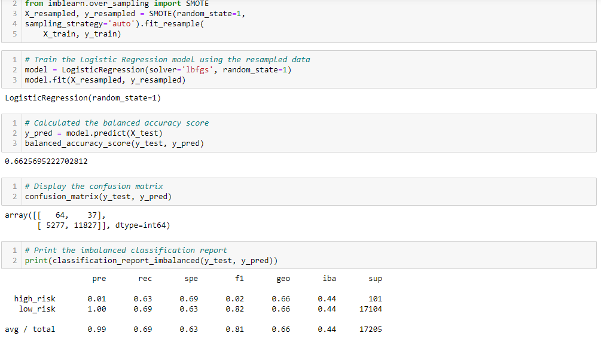

# Credit_Risk_Analysis
## Overview of the Analysis
## Purpose of the Analysis
## Results of the Analysis
Native Random Oversampling

- ### SMOTE Oversampling Results

- ### ClusterCentroids Undersampling Results

- ### SMOTEENN Combination Sampling Results

- ### Balanced Random Forest Classifier

- ### Easy Ensemble AdaBoost Classifier

## Summary of the Analysis
### Reccomendation
