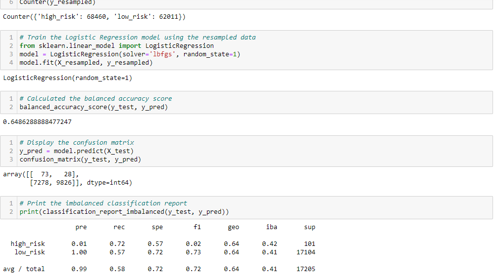

# Credit_Risk_Analysis
## Overview of the Analysis

Credit risk is an inherently unbalanced classification problem, as good loans easily outnumber risky loans. Therefore, I employed different techniques to train and evaluate models with unbalanced classes. I used imbalanced-learn and scikit-learn libraries to build and evaluate models using resampling.

Using a CSV credit card credit dataset from LendingClub, a peer-to-peer lending services company, I oversampled the data using the RandomOverSampler and SMOTE algorithms, and undersampled the data using the ClusterCentroids algorithm. Then, I used a combinatorial approach of over- and undersampling using the SMOTEENN algorithm. Next, I compared two new machine learning models that reduce bias, BalancedRandomForestClassifier and EasyEnsembleClassifier, to predict credit risk.

## Purpose of the Analysis
Now that I have completed the analysis, the information below highlights the performance of the six models. I will also provide a recommendation on whether any of the models should be used to predict credit risk.

## Results of the Analysis

- ### Native Random Oversampling

- ### SMOTE Oversampling Results

- ### ClusterCentroids Undersampling Results

- ### SMOTEENN Combination Sampling Results

- ### Balanced Random Forest Classifier

- ### Easy Ensemble AdaBoost Classifier

## Summary of the Analysis
### Recommendation
