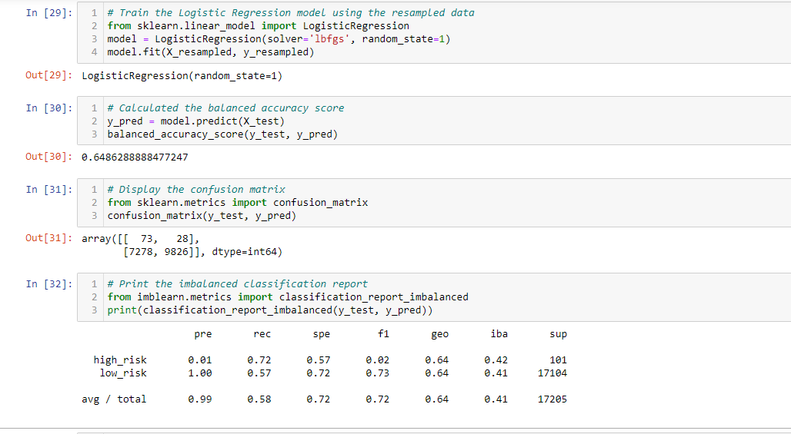
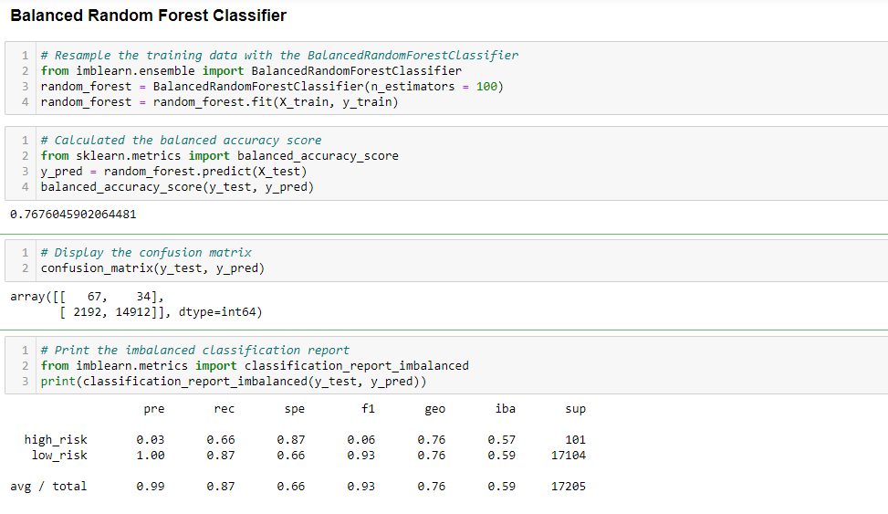
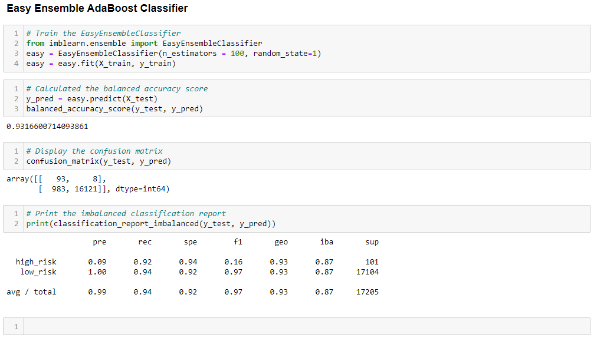

# Credit_Risk_Analysis
## Overview of the Analysis

Credit risk is an inherently unbalanced classification problem, as good loans easily outnumber risky loans. Therefore, I employed different techniques to train and evaluate models with unbalanced classes. I used imbalanced-learn and scikit-learn libraries to build and evaluate models using resampling to predict credit risk.

Using a CSV credit card credit dataset from LendingClub, a peer-to-peer lending services company, I oversampled the credit card data using the RandomOverSampler and SMOTE algorithms, and undersampled the data using the ClusterCentroids algorithm. Then, I used a combinatorial approach of over- and undersampling using the SMOTEENN algorithm. Next, I compared two new machine learning models that reduce bias, BalancedRandomForestClassifier and EasyEnsembleClassifier, to predict credit risk.

## Purpose of the Analysis
The purpose of this analysis is to determine if any of the six models provide a reliable credit risk predicitve tool using the provided dataset from LendingClub. I will also provide a recommendation concerning one or more of the model's performance. That is, what percentage does it accuractely predict? Each of the models reported an accuracy score and confusion matrix array with four quadrants. The columns of each array represent the predicted high and predicted low risks. 

## Results of the Analysis

- ### Native Random Oversampling

The first model above reported an accuracy test of 65%, a precision score of 99%, and a recall score of 58%. The accuaracy and recall scores are not strong enough to be reliable metrics for predicting credit risk.

- ### SMOTE Oversampling Results

The second model above reported an accuracy test of 66%, a precision score of 99%, and a recall score of 69%. The accuaracy and recall scores are not strong enough to be reliable metrics for predicting credit risk.

- ### ClusterCentroids Undersampling Results

The third model above reported an accuracy test of 66%, a precision score of 99%, and a recall score of 67%. The accuaracy and recall scores are not strong enough to be reliable metrics for predicting credit risk.

- ### SMOTEENN Combination Sampling Results

The fourth model above reported an accuracy test of 65%, a precision score of 99%, and a recall score of 72%. The accuaracy and recall scores are not strong enough to be reliable metrics for predicting credit risk.

- ### Balanced Random Forest Classifier

The fifth model above reported an accuracy test of 77%, a precision score of 99%, and a recall score of 87%. The accuaracy and recall scores are higher than the previous four, but are not strong enough to be reliable metrics for predicting credit risk.

- ### Easy Ensemble AdaBoost Classifier

The sixth model above reported an accuracy test of 93%, a precision score of 99%, and a recall score of 94%. The accuaracy and recall scores are much beter than the previous five and are approaching reliable predictive strength, but are not strong enough to be reliable metrics for predicting credit risk.

## Summary of the Analysis
In the first four models I undersampled, oversampled and did a combination of both to determine which model is best at predicting which loans are the highest risk. The next two models resampled the data using ensemble classifiers to try and predict which which loans are high or low risk. In the first four models the accuracy score is not as high as the ensemble classifiers and the recall in the oversampling/undersampling/mixed models is low as well. It appears that the Easy Ensemble had the best balance of all the models because of it's higher accuracy score and balance of precision and recall scores.

### Recommendation
All models show poor results, except the Easy Ensemble AdaBoost Classifier which shows promise. Of the six models the Easy Ensemble provided the best predictive analysis of the dataset with metrics at 93% or above. However, the metrics are not indicative of a reliable statistical tool returning at least 99.5% and above predictive reliability. For that reason, I would strongly recommend to improve the LogisticRegression model by using a solver not found in the six models used in this analysis. 
